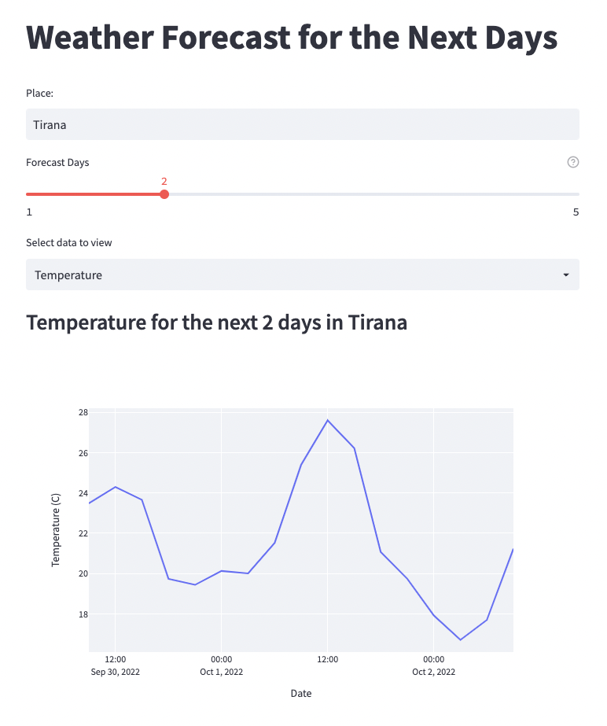

# Weather Forecast App

## Overview
This project provides a simple weather forecast application built using Streamlit and the OpenWeatherMap API. Users can input a location and select the number of days for which they want to see the weather forecast. The application then displays either temperature or sky condition data for the specified location and time frame.

## Dependencies
The project relies on the following Python libraries:
- [Streamlit](https://streamlit.io/) - for building interactive web applications
- [Plotly Express](https://plotly.com/python/plotly-express/) - for creating interactive plots
- [Requests](https://docs.python-requests.org/) - for making HTTP requests

## Setup
To run the project, follow these steps:
1. Clone the repository: `git clone https://github.com/tur14cus/weather-forecast-app.git`
2. Install dependencies: `pip install streamlit plotly requests`
3. Obtain an API key from [OpenWeatherMap](https://openweathermap.org/api) and replace `API_KEY` variable in `backend.py` with your key.
4. Run the Streamlit application: `streamlit run main.py`
5. Enter the location and select the number of forecast days to view the weather forecast.

## Usage
The Streamlit application provides input fields and dropdown menus to interact with the weather forecast data. Users can input a location, select the number of forecast days, and choose whether to view temperature or sky conditions.

## Structure
The project consists of the following files:
- `main.py`: Contains the Streamlit application code for displaying the weather forecast interface.
- `backend.py`: Defines functions to fetch weather data from the OpenWeatherMap API.
- `README.md`: This readme file providing an overview of the project.

## Contributions
Contributions are welcome. Feel free to fork the repository, make improvements, and submit pull requests.

## License
This project is licensed under the [MIT License](LICENSE).
